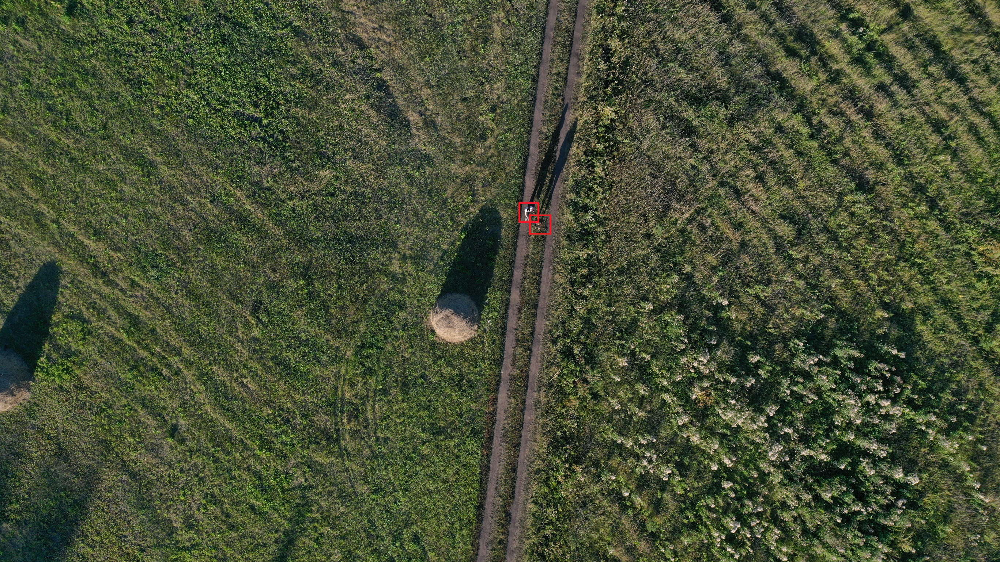
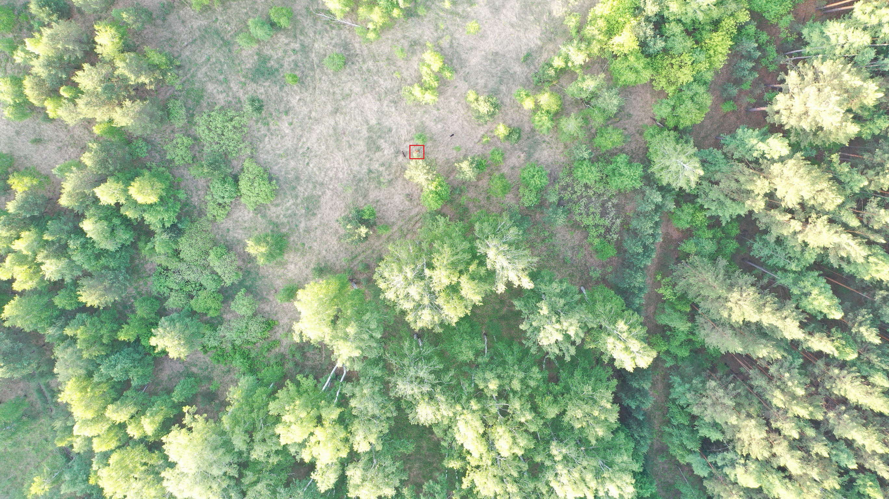
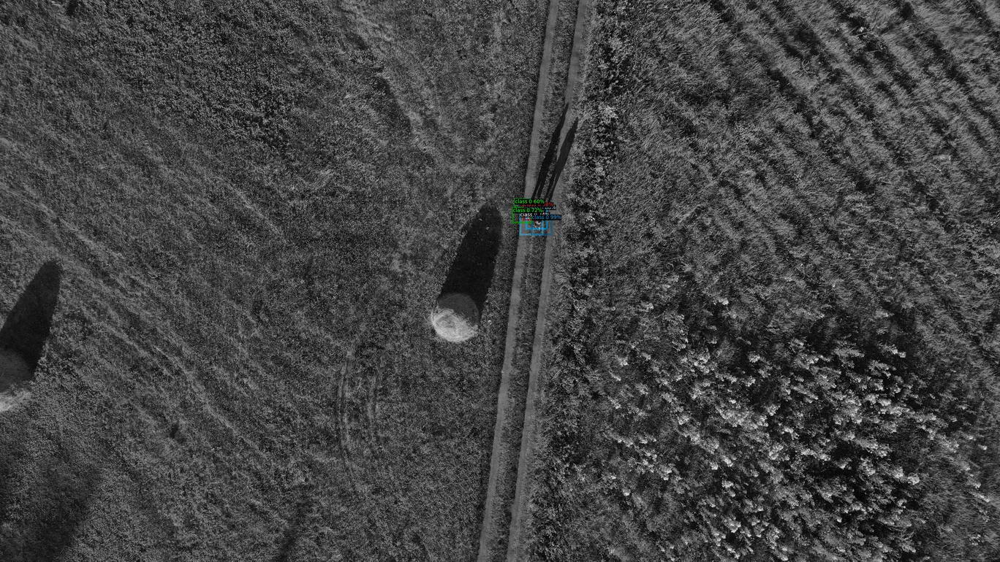
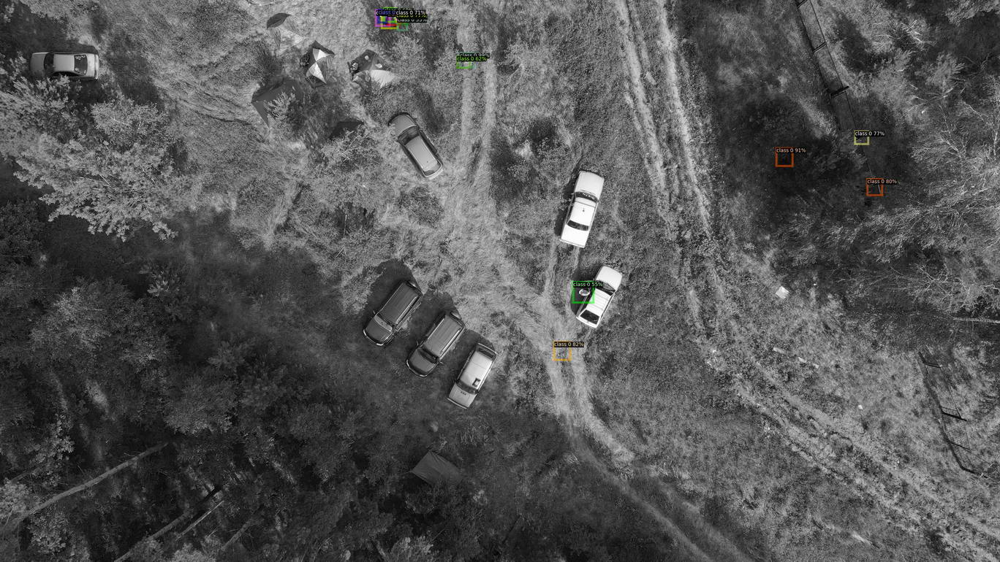
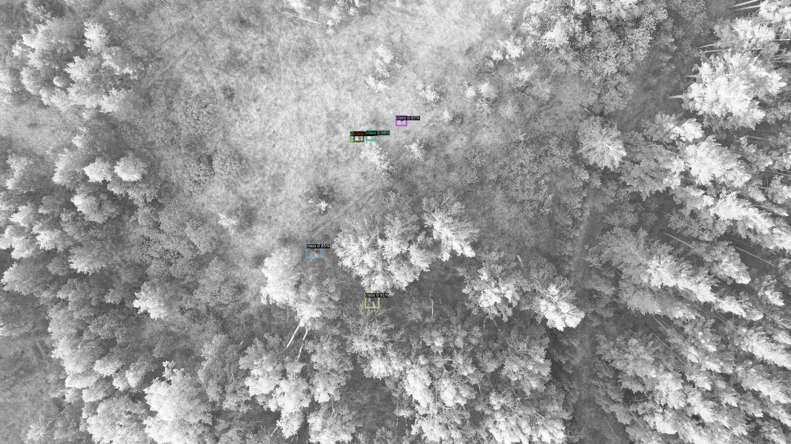
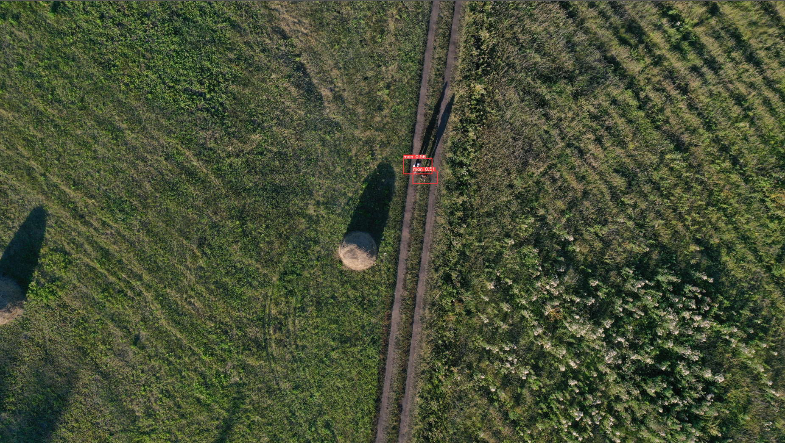
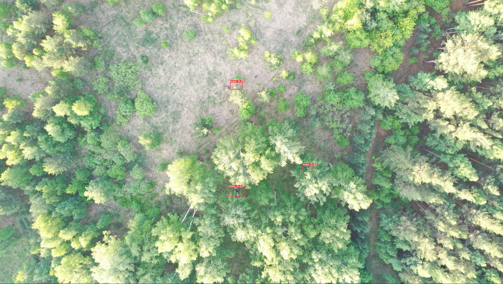
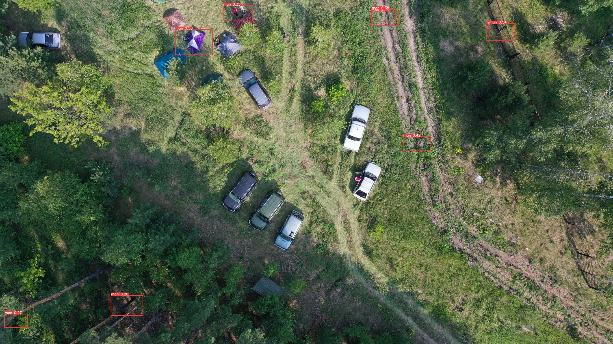
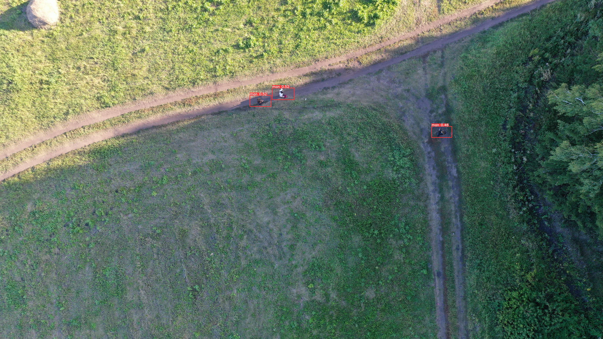

# курс [OTUS Computer Vision](https://otus.ru/lessons/cv/)

## Поиск людей на снимках лесного массива, полученных с помощью БПЛА.

Имеется датасет от "Лиза Алерт", в датасете 58 фотографий, на которых присутствуют люди и несколько тысяч фото без людей.

### Для начала попробуем использовать Detectron.

Ноутбук liza_alert_detectron.ipynb - аугментация не используется.

Ноутбук liza_alert_detectron_with_augmentations.ipynb - используем аугментацию:
```
transform = A.Compose([
    A.GaussianBlur(p=0.05),
    A.HorizontalFlip(p=0.5),
    A.VerticalFlip(p=0.5),
    A.RandomBrightnessContrast(p=0.2),
], bbox_params=A.BboxParams(format='coco'))
```

см. https://albumentations.ai/docs/getting_started/bounding_boxes_augmentation/.  
С aугментацией результат оказался значительно хуже.  
И в целом Detectron2 показал слабые результаты на данном датасете.

### Теперь перейдем к YOLO.

Ноутбуки называются соответствующим образом:

liza_alert_yolov5.ipynb - YOLOv5

liza_alert_yolov8.ipynb - YOLOv8

В итоге YOLOv5 показывает несколько лучший результат на данном датасете.

#### Opигинaльныe фото:





#### Detectron2





#### YOLOv5:





#### YOLOv8:




#### YOLTv5:



